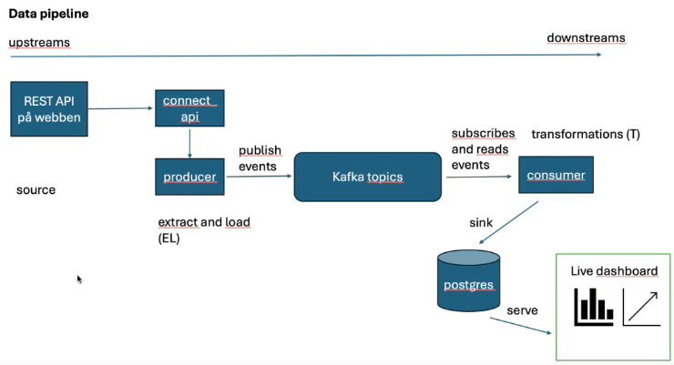

# data-platforms-freya

### **Virtual evironment**

- A virtual environment isolates your Python project from the global system environment, ensuring that your project uses its own specific versions of Python and dependencies.
This helps avoid conflicts when working on multiple projects that require different versions of packages or libraries.

- If you don’t use or activate a virtual environment, you risk breaking projects, causing conflicts, and making your Python environment harder to manage. If you dont have it turned on, packages will be installed in the global Python environment, affecting all projects. This can lead to version conflicts between projects.

---

**How to check if a virtual environment is active**
    Look at the terminal prompt. The name of the environment(.venv) usually appears
**Check the Python executable path:**
    "where python" - If the path points to your virtual environment's bin or Scripts directory, your virtual environment is active. (its only where python is tho)
    better might be **echo $VIRTUAL_ENV**
**How to turn on a virtual environment**
    - .\my_env\Scripts\activate
    - If you're already in the project folder and the virtual environment is in a folder named venv: .\venv\Scripts\activate

**How to turn off a virtual environment**
    deactivate

**Create ENV**
    python -m venv .venv

- (data-platforms-freya\.venv\Scripts\python.exe)

---

**Having the newest version is not always the best because its not always supported** Therefore it might be better to have an older version GLOBALLY. Exempel:

- Change installation version: **uv venv --python 3.12**

---

## Glossories 0
| terminology          | explanation                                                                 |
| -------------------- | --------------------------------------------------------------------------- |
| assign               | Att ge ett värde till en variabel med hjälp av `=`. T.ex. `x = 10` betyder att variabeln `x` nu har värdet 10. |
| logical error        | Ett fel i programlogiken där programmet körs utan att krascha, men ger felaktiga resultat. |
| handling error       | Att hantera fel som kan uppstå i programmet, t.ex. genom att använda `try` och `except` för att undvika krascher. |
| indexing             | Att hämta ett specifikt värde från en lista, tuple eller sträng med hjälp av dess position (index). T.ex. `my_list[0]` ger det första värdet. |
| slicing              | Att ta en del av en lista, tuple eller sträng. T.ex. `my_list[1:4]` ger värdena från position 1 till 3. |
| iterable             | Ett objekt som kan loopas igenom, som en lista, sträng eller range. T.ex. kan du loopa igenom `for item in my_list`. |
| iterate over         | Att gå igenom alla värden i en lista, sträng eller liknande med hjälp av en loop. T.ex. `for item in my_list:`. |
| list comprehension   | Ett kort sätt att skapa listor i en rad. T.ex. `[x*2 for x in range(5)]` skapar en lista där alla tal multipliceras med 2. |
| collections          | En samling specialfunktioner i Python för att hantera listor, räkna saker och mycket mer. |
| tuples               | En samling värden som liknar en lista, men som inte kan ändras efter att de skapats. T.ex. `my_tuple = (1, 2, 3)`. |
| \_\_repr\_\_         | En speciell funktion i Python som beskriver hur ett objekt ska visas i text för utvecklare. |
| dunder methods       | Kallas också "dubbel-understreck-metoder", som t.ex. `__init__` eller `__repr__`. Dessa används för speciella funktioner i Python. |
| pythonic             | Ett sätt att skriva kod som är typiskt för Python – tydlig, enkel och lätt att förstå. |
| idiomatic            | Ett sätt att skriva kod som följer de bästa vanliga sätten för ett visst programmeringsspråk. |
| DRY                  | Står för "Don't Repeat Yourself". Det betyder att du ska undvika att skriva samma kod flera gånger. |
| spaghetti code       | Kod som är svår att läsa och förstå för att den är rörig och dåligt organiserad. |
| keyword arguments    | När du skickar ett argument till en funktion med ett namn. T.ex. `print(name="Alice")`. |
| positional arguments | När du skickar ett argument till en funktion baserat på ordningen. T.ex. `print("Alice", 25)`. |
| \*args               | Används i en funktion för att ta emot många värden utan att skriva ut dem enskilt. T.ex. `def func(*args):`. |
| \*\*kwargs           | Används i en funktion för att ta emot många nyckelord-argument, t.ex. `def func(**kwargs):`. |
| unpacking list       | Att dela upp en lista eller tuple i flera delar. T.ex. `a, b = [1, 2]` ger `a = 1` och `b = 2`. |
| return statement     | När en funktion skickar tillbaka ett värde. T.ex. `def add(x, y): return x + y`. |
| ternary operator     | Ett kort sätt att skriva en if-sats. T.ex. `x = 10 if condition else 5` ger `x = 10` om villkoret är sant, annars `5`. |
| json                 | Ett sätt att lagra och skicka data som ser ut som text, vanligt inom webbutveckling. T.ex. `{"name": "Alice", "age": 25}`. |

## Glossories 1
| terminology           | explanation |
| --------------------- | ----------- |
| dataframe             | **Dataframe** är en tabellstruktur i Python, som är en del av **Pandas**-biblioteket. Det organiserar data i rader och kolumner, där varje kolumn kan hålla olika typer av data. Dataframes är centrala för dataanalys eftersom de gör det lätt att manipulera och utforska data. |
| series                |**Series** är en en-dimensionell array-liknande struktur i **Pandas**, liknande en kolumn i ett dataframe. Den håller data i en sekvens med ett associerat index (etiketter) för varje värde, vilket gör den mer flexibel än en vanlig lista eller array. |
| pandas concat         | **Pandas concat** är en funktion som låter dig sammanfoga flera dataframes eller series längs rader (axel 0) eller kolumner (axel 1). Det används ofta när du vill slå samman eller lägga till data från flera källor till ett enda dataset. |
| pandas apply          | **Pandas apply** används för att tillämpa en funktion längs en axel i ett dataframe (rader eller kolumner). Det är särskilt användbart för att utföra komplexa operationer på data utan att skriva explicita loopar. Du kan applicera inbyggda eller egna funktioner för att manipulera eller analysera data. |
| csv                   | **CSV** står för "Comma-Separated Values" och är ett enkelt textbaserat filformat där data representeras i tabellform, med värden separerade med kommatecken. CSV-filer används ofta för att lagra och utbyta data eftersom de är lätta att läsa och skriva. |
| pandas isnull         | **Pandas isnull** är en funktion som används för att kontrollera om det finns saknade eller **NaN** (Not a Number) värden i ett dataframe eller series. Den returnerar ett boolean-resultat (True eller False) som visar om varje element i datasetet är saknat eller inte. Detta är avgörande för att hantera ofullständig data. |
| masking in pandas     | **Masking i pandas** innebär att filtrera eller välja data baserat på specifika villkor. Till exempel kan du skapa en boolean mask (en True/False-villkor) för att extrahera rader eller kolumner som uppfyller ett visst kriterium, t.ex. att välja värden som är större än ett tröskelvärde. |
| pandas transpose      | **Pandas transpose** är en metod som byter plats på rader och kolumner i ett dataframe. Denna operation är användbar när du behöver ändra orienteringen på din data eller för bättre datavisualisering. Det låter dig byta mellan rader som kolumner och vice versa. |
| pandas value_counts() | **Pandas value_counts()** är en funktion som räknar hur ofta varje unikt värde förekommer i en kolumn eller series. Den är mycket användbar när du behöver sammanfatta eller analysera fördelningen av kategorisk data och hjälper dig förstå hur ofta varje värde förekommer. |
| json                  | **JSON** (JavaScript Object Notation) är ett lättviktsformat för att lagra och överföra strukturerad data på ett läsbart sätt. Det är strukturerat som nyckel-värde-par och används ofta i webbapplikationer och API:er för att skicka data mellan server och klient. |
| tabular data          | **Tabulär data** refererar till data som är organiserad i rader och kolumner, precis som i en tabell. Detta är det vanligaste sättet att representera och analysera data, särskilt i kalkylblad, databaser och dataanalysverktyg som Pandas. |
| zero-based indexing   | **Zero-baserad indexering** är när man numrerar elementen i en lista, array eller dataframe från 0 istället för 1. Detta innebär att det första elementet har index 0, det andra elementet har index 1 och så vidare. Detta är vanligt i de flesta programmeringsspråk som Python. |

## Glossories 2
| terminology               | explanation |
| ------------------------- | ----------- |
| host system               | This is the physical or virtual computer that provides the power (CPU, memory, storage) for running virtual machines or containers. Think of it as the "real" computer where everything happens. |
| virtualization            | This is the process of using software to make one physical machine act like several. It lets you run multiple systems (virtual machines or containers) on one physical computer.|
| spin up                   | "Spinning up" means starting a new virtual machine or container. It’s like turning on a new computer or app in a virtual environment. |
| dockerize                 | To "dockerize" an app is to put it into a Docker container. This makes it easier to run anywhere without worrying about system differences. |
| docker build              | This command builds a Docker image from a Dockerfile. It takes the instructions in the file and creates an image (a template) for running the app inside a container. |
| docker run                | This command starts a container from an image. It’s like turning the image (the template) into a live, running app inside a container. |
| docker layers             | Each Docker image is made up of layers. Every change (like adding files or installing software) creates a new layer. This helps Docker save space and speed up builds by reusing parts that haven’t changed. |
| container                 | A container is a small, isolated environment where an app can run. It includes everything the app needs (code, libraries, settings) to work anywhere, even on different computers. |
| image                     | 	An image is a template used to create containers. It’s like a blueprint for a container, and you can think of it as a packaged version of your app with all its dependencies. |
| docker compose up -d      | This command starts multiple containers at once, running them in the background. It’s like launching a bunch of apps from a list without seeing all the details in the terminal. |
| docker compose up --build | This command starts the containers, but also rebuilds any images if needed (for example, if the app changed) before running them. |
| docker compose down       | 	This stops and removes the containers and networks created by Docker Compose. It’s like cleaning up and turning everything off. |
| docker exec -it /bin/bash | This command opens an interactive terminal inside a running container, so you can run commands inside it, just like using the terminal on your own computer. |
| docker inspect            | This command gives you detailed information about a container or image, like how it was created or what settings it has. It’s helpful for troubleshooting or understanding how things work. |
| docker ps                 | 	This command lists all the containers that are currently running. It’s like checking which apps are open and running right now. |
| docker volume ls          | 	Volumes are special storage areas for containers. This command shows all the volumes that exist, which are used to keep data even when containers are stopped or deleted. |
| docker container ls -a    | This shows all containers, even the ones that aren’t running. It's helpful for seeing containers that were started in the past but aren't active now. |
| docker image ls -a        | 	This shows all Docker images on the system, even those that aren’t currently in use. It helps you see everything available to create containers from. |
| docker image prune        | This command removes images that aren’t being used, helping free up space on your system by cleaning up old images. |
| docker container prune    | Similar to the image prune command, this removes containers that have stopped and are no longer needed, saving space.|
| tag                       | A tag is like a label for a Docker image that helps identify different versions (e.g., myapp:1.0 for version 1.0). It’s a way to manage different builds of the same image. |
| docker rm                 | 	This command removes a stopped container from your system, cleaning it up to free space or resources. |

## Glossories 3

