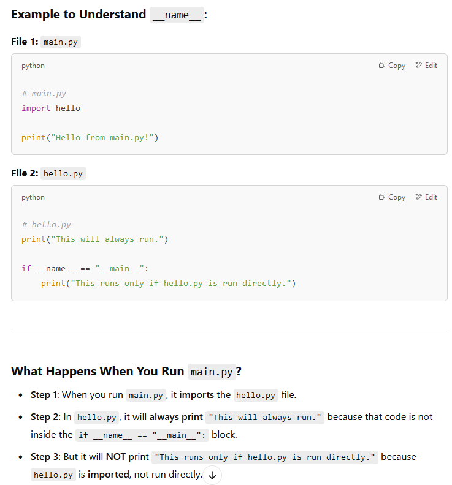
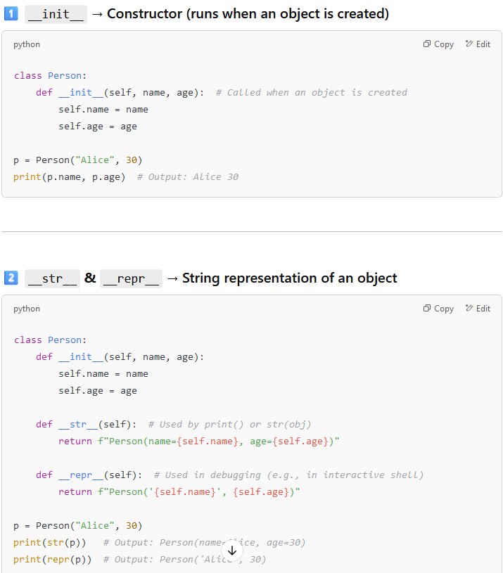

### __init__ (The Builder)

Think of __init__ as a construction worker who builds your object. Every time you create a new object, __init__ runs automatically and sets up its parts.

python´´´
class Dog:
    def __init__(self, name, age):
        self.name = name  # The dog's name
        self.age = age    # The dog's age

my_dog = Dog("Buddy", 3)  # Creates a new dog
print(my_dog.name)  # Output: Buddy
print(my_dog.age)   # Output: 3
´´´

**👉 What happens?**

    When Dog("Buddy", 3) is called, Python runs __init__, setting the dog's name to "Buddy" and age to 3.
    Now, my_dog remembers its name and age!

---

### __str__ (The Friendly Introducer)

Think of __str__ like a name tag on a person. When you print() an object, __str__ tells Python what to show so that humans can understand it.
Example:

python´´´
class Dog:
    def __init__(self, name, age):
        self.name = name
        self.age = age

    def __str__(self):  # What happens when you print the object?
        return f"This is {self.name}, who is {self.age} years old."

my_dog = Dog("Buddy", 3)
print(my_dog)  # Output: This is Buddy, who is 3 years old.
´´´

**👉 What happens?**

    Without __str__, printing my_dog would just show something weird like <Dog object at 0x123abc>.
    __str__ makes it human-friendly, so when you print my_dog, it shows "This is Buddy, who is 3 years old."

---

### __repr__ (The Debugging Expert)

Think of __repr__ as a detective report. It's not for humans—it’s for programmers who need to debug their code. It should describe the object in a way that can be used to recreate it later.
Example:´

python´´´
class Dog:
    def __init__(self, name, age):
        self.name = name
        self.age = age

    def __repr__(self):  # A more technical representation
        return f"Dog('{self.name}', {self.age})"

my_dog = Dog("Buddy", 3)
print(repr(my_dog))  # Output: Dog('Buddy', 3)
´´´

**👉 What happens***
    If you're debugging, you might want to see all details about my_dog.
    __repr__ shows "Dog('Buddy', 3)", which tells you exactly how to recreate the object if needed.

---

---

| Dunder Method        | Description                                          |
|----------------------|------------------------------------------------------|
| `__init__`          | Initializes a new object (constructor).               |
| `__str__`           | Defines the string representation of an object (for `print()`). |
| `__repr__`          | Defines an official string representation (for debugging). |
| `__len__`           | Defines behavior for `len(obj)`.                      |
| `__call__`          | Allows an object to be called like a function.       |
| `__getitem__`       | Enables indexing (`obj[key]`).                       |
| `__setitem__`       | Allows setting values (`obj[key] = value`).          |
| `__delitem__`       | Enables deleting an item (`del obj[key]`).           |
| `__iter__`          | Makes an object iterable (used in loops).            |
| `__next__`          | Defines behavior for `next(obj)`, used in iterators. |
| `__eq__`, `__lt__`, `__gt__`, etc. | Define comparison operations (`==`, `<`, `>`). |
| `__enter__` / `__exit__` | Used in context managers (`with` statement). |

