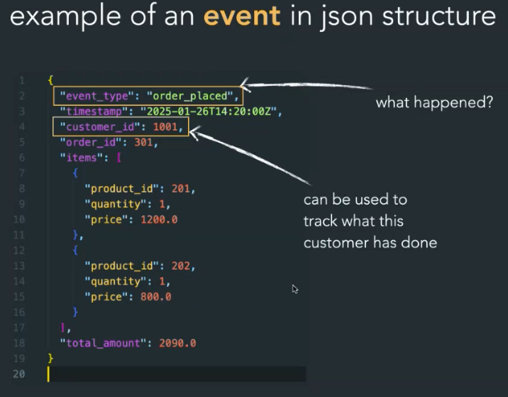

## Vad är Apache Kafka?

Apache Kafka är en **öppen källkodsplattform** som används för att hantera och bearbeta **real-time data streams**. Det används ofta för att samla in, överföra, lagra och analysera stora mängder data från olika källor i realtid.

(Används i många branscher där snabb och skalbar datahantering är kritisk, som finans, e-handel, IoT och logghantering.)

### Grundläggande funktioner
- **Meddelandehantering (Message Broker):** Kafka fungerar som en "message broker" som tar emot data (meddelanden) från olika källor och distribuerar den till konsumenter (t.ex. applikationer).

**Distribuerad och skalbar:** Kafka är byggt för att fungera i kluster, vilket innebär att det kan hantera stora datamängder och är skalbart över flera servrar.

**Hög genomströmning och låg latens:** Kafka är optimerat för att hantera miljontals meddelanden per sekund med minimal fördröjning.

**Lagring av data:** Kafka lagrar inkommande data på disk, vilket gör att konsumenter kan läsa data när det passar dem, utan att tappa några meddelanden.

---
### Hur fungerar Apache Kafka?
**Producenter och konsumenter:**
- Producenter skickar data till Kafka.
- Konsumenter läser data från Kafka.

**Topics:**

Data i Kafka organiseras i topics, som är kategorier eller "kanaler" där data publiceras.
    **Exempel**:
    - sensor_data
    - user_logs

**Partitioner**:
    Varje topic är uppdelat i partitioner, vilket möjliggör parallellism och hög prestanda. Varje partition lagrar en sekventiell logg av meddelanden.

**Broker**:
    En broker är en Kafka-server som hanterar lagring och distribution av data i klustret.

**Konsumentgrupper**:
    Flera konsumenter kan läsa från samma topic i grupper, vilket möjliggör skalbar bearbetning av data.

