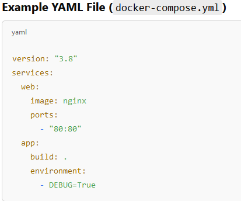

## Vad är Apache Kafka?

Apache Kafka är en **öppen källkodsplattform** som används för att hantera och bearbeta **real-time data streams**. Det används ofta för att samla in, överföra, lagra och analysera stora mängder data från olika källor i realtid.
(Används i många branscher där snabb och skalbar datahantering är kritisk, som finans, e-handel, IoT och logghantering.)

---
http://localhost:9021/clusters : is related to Kafka, specifically to Kafka UI tools like Confluent Control Center or Kafdrop.

If you are running Kafka inside Docker using a UI tool like Confluent Control Center, Kafdrop, or Redpanda Console, they often run on port 9021 to provide a web-based interface for managing Kafka clusters.
How It Relates to Docker & Kafka

- If you are running Kafka in Docker (using docker-compose), the UI tool is likely containerized too.

### Check If It's Running
**Try opening http://localhost:9021/clusters in your browser:**
- If it works → You have a Kafka UI tool running.
- If not → The service may not be running, or you might need to start it using docker-compose up -d.

---

### Grundläggande funktioner
- **Meddelandehantering (Message Broker):** Kafka fungerar som en "message broker" som tar emot data (meddelanden) från olika källor och distribuerar den till konsumenter (t.ex. applikationer).

**Distribuerad och skalbar:** Kafka är byggt för att fungera i kluster, vilket innebär att det kan hantera stora datamängder och är skalbart över flera servrar.

**Hög genomströmning och låg latens:** Kafka är optimerat för att hantera miljontals meddelanden per sekund med minimal fördröjning.

**Lagring av data:** Kafka lagrar inkommande data på disk, vilket gör att konsumenter kan läsa data när det passar dem, utan att tappa några meddelanden.

---
### Hur fungerar Apache Kafka?

**Topics:**

Topics är som "postlådor" där **events** sorteras och kategoriseras.
Varje topic har ett namn, t.ex. user_activity eller sensor_data, så att konsumenter (de som hämtar data) vet var de ska leta.
Tänk dig att varje topic är en specifik hylla i postkontoret där posten för olika kategorier sparas.
**Exempel**:
- sensor_data
- user_logs

**Producenter och konsumenter:**
- Producers send data to Kafka. En producer är en enhet (t.ex. en app eller en tjänst) som skickar data till Kafka. Tänk på en producer som någon som lägger brev (meddelanden) i en postlåda (Kafka topic).

- Consumers read data from Kafka. Consumer är en enhet som läser data från Kafka. Tänk på en consumer som en person som hämtar och läser breven från postlådan (topic).

**Broker**: Är en server med massa topics 

- En broker tar emot events från producenter(producer) och placerar dem i rätt topic (den rätta "postlådan").
- När en konsumenter(consumer) vill hämta data, hjälper brokern att leverera rätt meddelanden från rätt topic.
- Om det finns flera brokers i ett kluster (flera Kafka-servrar som samarbetar), så delar de upp ansvaret för att lagra och skicka data.
- I Docker används brokers ofta i system som Apache Kafka för att hantera och distribuera events.

**Events (händelser):**

- Ett event är en bit data eller information som beskriver att något har hänt, till exempel en ny order i en webbutik eller att en sensor registrerat en temperatur ("användare klickade på en knapp" eller "temperaturen är 25°C")
- I ett eventdrivet system skickar producenter (den som genererar eventet) detta vidare via brokern, och konsumenter tar emot och bearbetar eventet.
- Dessa events skickas av producenter (t.ex. en app, en sensor, eller en databas) till Kafka.

**Partitioner**:
- Varje topic är uppdelat i partitioner, vilket möjliggör parallellism och hög prestanda. Varje partition lagrar en sekventiell logg av meddelanden.

**Konsumentgrupper**:
- Flera konsumenter kan läsa från samma topic i grupper, vilket möjliggör skalbar bearbetning av data.

---

## YML (or YAML) stands for "YAML Ain't Markup Language". It is a human-readable data format used for configuration files.

### Why Use YAML?
- Easy to read and write (compared to JSON or XML).
- Uses indentation instead of brackets {} or tags < >.
- Commonly used in Docker Compose, Kubernetes, Ansible, and other tools.

---
### Quix Streams (from quixstreams import Application)

Quix Streams is a real-time data streaming framework designed to work with Apache Kafka. It simplifies the process of ingesting, processing, and analyzing streaming data using Python.

**What is Application in Quix Streams?**
In Quix Streams, Application is a class that helps you connect to Kafka and interact with topics.

**What Quix Streams Does**
- Simplifies Kafka operations (producing & consuming messages).
- Works natively with Python, making real-time data processing easier.
- Manages data streams efficiently, handling topics, serialization, and event-driven processing.

