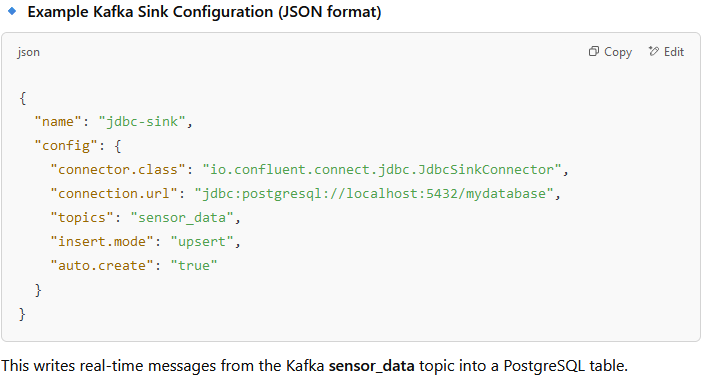
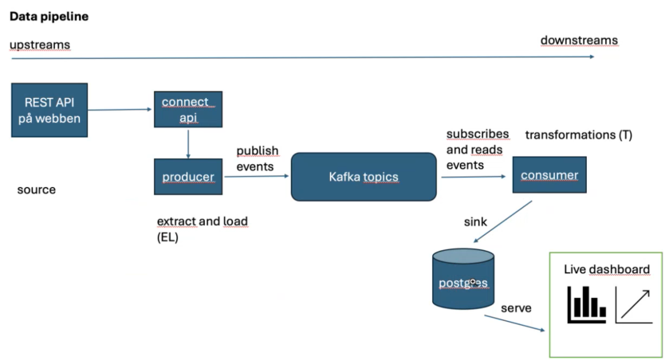

# What is a PostgreSQL Sink?

A PostgreSQL sink refers to a data destination where streaming data (real-time data) is written into a PostgreSQL database.

In data engineering and streaming pipelines, a sink is where data gets stored after it is processed. PostgreSQL can be used as a sink in real-time data pipelines to store incoming data from sources like Kafka, Flink, or CDC (Change Data Capture) systems.

### When is a PostgreSQL Sink Used?

- ✅ Streaming Analytics → Storing real-time data from Kafka or Flink for reporting.
- ✅ Change Data Capture (CDC) → Keeping PostgreSQL updated with live changes from another database.
- ✅ Log & Event Storage → Saving logs or user events into PostgreSQL.
- ✅ ETL (Extract, Transform, Load) Pipelines → Loading processed data from a data lake or warehouse.

---

### Example: Using PostgreSQL as a Sink in Different Technologies

1. **Kafka → PostgreSQL Sink**

Apache Kafka Connect can write streaming data to PostgreSQL using the JDBC Sink Connector.

---

### Creating a pipeline 

